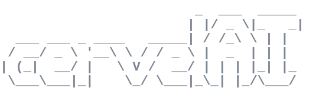

<div align="center">



*Pronounced like the French **« cervelet »** (cerebellum) — `/sɛʁ.və.lɛ/`*

### A comfy server, tailored for your AI.

[](LICENSE)
[](https://www.gnu.org/software/bash/)

</div>

---

```bash
bash -c "$(curl -fsSL https://raw.githubusercontent.com/BorisLord/cervelAI/main/bootstrap.sh)"
```

## What is cervelAI?

**An install script — nothing more.** It turns a fresh Debian-based box (a VM, LXC, or any cloud server) into a ready-to-use home for terminal AI coding agents — **Claude Code, Codex, opencode, Gemini CLI and 8 more** — with the runtimes, tools, memory backends and multiplexer they need. Run it, grab a coffee; a few prompts let you tweak, defaults just work.

It follows three principles:

- **Native & minimal.** [`mise`](https://mise.jdx.dev) owns every runtime and binary (precompiled, never compiled from source). The locale is OS-native (`/etc/default/locale`). Agents authenticate with their *own* login (`claude login`, `gh auth login`) — cervelAI stores **no API keys**. Its own runtime footprint is essentially one ntfy topic: remove cervelAI and the machine keeps running, you only lose the `cervel` conveniences.
- **Isolated by default.** Agents run as an **unprivileged `agent` user** (no sudo, locked password) — they execute untrusted code, so they can't touch the system. Admin is done as `root`, deliberately.
- **Disposable.** An idempotent script, not a hand-tuned server: re-run it to rebuild an identical box from a fresh image in minutes. Nothing precious lives here — no stored secrets, agents log in themselves — so wiping and recreating it costs nothing.

## After install

```bash
ssh agent@<host-ip>      # IP printed at the end of install (mosh also available)
```

You land in a persistent **tmux** session. `cervel` is the only cervelAI-specific command:

| Command | Does what |
|---|---|
| `cervel help` (`-h`) | logo + cheatsheet |
| `cervel status` (`-s`) | identity, agents on PATH, disk usage |
| `cervel ls` | list AI agents on PATH |
| `cervel run <cmd>` | run a command, **ntfy** push when it exits (long jobs) |

Everything else is native: **`aoe`** (Agent of Empires) orchestrates N agents in parallel, each in its own git worktree, with a web dashboard reachable from any device (URL + token printed in the journal); `tmux`/`zellij` manage sessions; `topgrade` updates the installed tools.

## What it installs

**A mandatory baseline — the foundation every coding agent needs to work out of the box:**

- **`mise`** — owns every runtime & binary (precompiled, never from source)
- **Runtimes core** — node, pnpm, python, uv + `tsc`/`tsx`/`ruff`, and a C/C++ base (gcc/g++/make)
- **Search & parsing** — ripgrep, fd, fzf, jq, yq, dasel, gron, ast-grep, bat
- **Universal LSPs** — bash, yaml, json, taplo, marksman, typescript, basedpyright
- **Git** — gh, delta

That alone lets an agent clone, read, search, edit and run code. **Then add the tools you actually want**, selected à la carte from a menu — **15 opt-in categories**, sensible defaults pre-selected, zero bloat:

<details>
<summary>The 15 categories</summary>

`agents` · `token-savers` · `agent-memory` · `usage-trackers` · `ai-tools` · `editor` · `runtimes` · `containers` · `k8s-stack` · `cloud-stack` · `data-stack` · `cli-extras` · `security-tools` · `git-tools` · `blockchain`

The menu shows the tools in each. After install, **`mise ls` is the source of truth** for what's there. Add anything later with `mise use -g <tool>`.
</details>

## Built to keep agents cheap

Coding agents burn tokens on verbose output, re-reading files, and re-learning context every session. cervelAI ships the antidotes:

- **token-savers** (`snip`/`rtk`) — strip 60-90% of CLI noise before it reaches the agent
- **agent-memory** (`engram`, `qmd`, `memsearch`…) — cross-session recall, no re-discovering the repo each time
- **usage-trackers** (`tokscale`, `ccusage`, `ccstatusline`) — see exactly what you spend
- **agent-aware tools** (baseline `rg`/`fd`/`ast-grep` + LSPs) — precise lookups instead of whole-file dumps
- **`AGENTS.md`** — a baseline prompt that tells every installed agent to use all of the above by default

## Isolation & admin

The `agent` user has **no sudo** and a locked password — an injected agent can't escalate to root. Admin is a deliberate root action:

```bash
ssh root@box '<cmd>'                 # non-interactive: skips the agent handoff
CERVELAI_NO_MENU=1 ssh -t root@box   # interactive root shell
```

> If you install the `containers`/docker category, the agent joins the `docker` group — a root-equivalent escalation path, accepted as a trade-off. Rootless `podman` is the isolated alternative.

A default-deny **`nftables`** firewall ships in the baseline: only `ssh`, `mosh` and the `aoe` dashboard are reachable inbound, so a port an agent opens (a stray dev server, say) isn't exposed to the network. It's netns-scoped — same ruleset works inside a VM or an unprivileged LXC.

### What isolation does *not* cover

The unprivileged `agent` can't take over the **host**, and the box is disposable — but a few risks are deliberately out of scope:

- **Exfiltration.** Agents run untrusted code *with your own logins on disk* (`~/.claude`, `~/.config/gh`) and unrestricted outbound network — an injected agent can read those tokens and your repos and send them anywhere. Isolation protects the host, **not your secrets**. Keep agent tokens short-lived/scoped, and use a separate box per trust level if it matters.
- **The `aoe` dashboard** binds `0.0.0.0:8080` (token-gated, and allowed through the firewall). Fine on a trusted LAN; on a public server **don't expose it** — reach it over an SSH tunnel (`ssh -L 8080:localhost:8080 agent@box`) or a mesh VPN (Tailscale/WireGuard).

## Supported environments

Debian 12+, Ubuntu 22.04+, any Debian/Ubuntu derivative with systemd as PID 1.

## Updates

```bash
topgrade     # as agent: mise + every user-space backend, one shot
```

System/apt security patches apply automatically (native `unattended-upgrades`). A full system upgrade is a deliberate root action (`apt update && apt upgrade`) — the unprivileged agent can't touch apt by design.

## Advanced (CI / forks)

The menu drives everything; env vars only matter for headless installs and forks.

<details>
<summary>Headless install + env reference</summary>

```bash
# GITHUB_TOKEN avoids GitHub API rate-limit 403s on a full `all` install (not persisted)
GITHUB_TOKEN=ghp_… dev_mode=nomenu CERVELAI_NO_PROMPT=1 CERVELAI_SELECTED=all bash setup.sh
```

| Variable | Effect |
|---|---|
| `CERVELAI_SELECTED` | CSV of opt-in categories (or `all`) |
| `CERVELAI_SHELL` / `_MULTIPLEXER` | `bash\|zsh` / `tmux+aoe\|zellij\|none` |
| `CERVELAI_<CATEGORY>` | CSV per category (e.g. `CERVELAI_RUNTIMES=go,rust`) |
| `CERVELAI_SSH_KEY` | pubkey added to `agent` + sshd key-only hardening |
| `GITHUB_TOKEN` | lifts the GitHub API rate limit **during install** (not persisted) |
| `CERVELAI_NO_MENU` | skip the tmux handoff (gives a plain root/agent shell) |

LXC mode: `bootstrap.sh --lxc` (needs `pct` on a Proxmox host) creates the container, then runs `setup.sh` inside. Forks: `CERVELAI_REPO` / `CERVELAI_REF`.
</details>

## Contributing

PRs and issues welcome.

## License

MIT.
